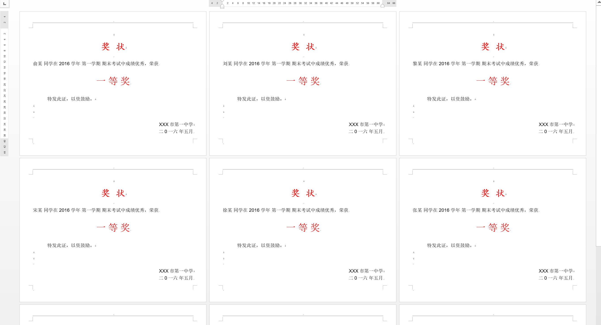

# reportgen
> 本文将介绍Matlab的一个实用技巧。一键生成Word版本的报告。Matlab之前都是通过调用COM接口来实现的，类似于VBA，虽然可做的事情很多，但并不适合一般的童鞋。

## 1. 自动化报告

测试平台:   MATLAB 2015b 

先来看一个最简单的例子(demo1.m)

```Matlab
% demo1.m
import mlreportgen.dom.*;
d = Document('demo1','docx');
open(d);
append(d,'hello world!');
close(d);
rptview(d.OutputPath);
```

```Matlab
import mlreportgen.dom.*;
```
第一行是将所需要的类和函数导入工作空间。这里我们最常用的类就是Document.
```Matlab
d = Document('test','docx');
open(d);
```
在第二、三行中我们新建一个文档，其中文件类型`docx`可以替换成`html`或者`pdf`. Document类的相关属性可以通过命令查看 (doc mlreportgen.dom.Document)
```Matlab
append(d,'hello world!');
```
在第四行我们给文档添加了一句经典的话，我们还可以自定义它们的样式。比如加粗、斜体、改成蓝色、字体大小等等。
```Matlab
% 替换上面的一行代码
p=Text('hello world');
p.Style={Bold(true),FontSize('16pt'),Color('blue')};
p.Strike='double';
append(d,p)
```
这里出现了第一个文档类：`Text`，即文本。Matlab提供了很多可调节的属性，如下表。修改起来也很方便，如要把文本改为斜体，则添加：`p.Italic=1;`即可。

| `Text`的属性 |  取值  |  备注   |
| :---- |:----| :---|
|Bold   |  true/false   | 加粗|
|Color   | str('red'、'blue'等)   |颜色|
|Italic  | true/false  |  斜体|
|BackgroundColor | str| 背景色|
|Underline| str('single'、'dotdash'等)| 下划线|
|FontFamilyName| str | 字体|
|FontSize| str('12pt')| 字体大小|
|Strike| str| 删除线|
|StyleName| str| 模板中的样式名|


接下来我们将生成一个更复杂的文档。首先想想一个word文档一班都有哪些元素。MATLAB提供了很多(下面的表格仅列出了部分)。本文主要介绍其中的五个：页面设置、标题、段落、表格、图片。

| 属性          |        含义    |
| :-------------: | :--------|
|CustomAttribute  | Custom element attribute|
|CustomElement    | Custom element of a document|
|CustomText       | Plain text to be appended to a custom element|
|DOCXPageFooter   | Page footer for a Word document.|
|DOCXPageHdrFtr   | Page Base class for page header and footer|
|DOCXPageHeader   | Page header for a Word document.|
|DOCXPageMargins  | Margins of pages in a Word page layout|
|DOCXPageSize     | Size, orientation of pages in a Word layout|
|DOCXSection      | Page layout section of a Word document|
|**Document**         | Create a dom document|
|ExternalLink     | Create a hyperlink to an external target|
|Form             | Defines a form|
|FormalTable      | Create a formal table|
|Group            | Group of document objects|
|Heading          | Create a heading paragraph.|
|HorizontalRule   | Create a horizontal rule.|
|**Image**            | Create an image to be included in a report.|
|ImageArea        | Defines an image area as a hyperlink|
|InternalLink     | Create a hyperlink to a target in this|
|LinkTarget       | Create a target for a hyperlink.|
|ListItem         | Item in a list|
|Node             | Defines a document node|
|Object           | Defines a document object|
|OrderedList      | Ordered (numbered) list|
|Paragraph        | Create a formatted block of text, i.e., a paragraph.|
|**Table**        | Create a table.|
|TableColSpecGroup| Defines style of a group of table columns|
|TableEntry|       Create a table Entry|
|TableRow |         Creates a table row|
|Template|          Create a template for a document|
|**Text**|           Create a text object |

接下来我们做一个完整的模板。首先新建空白文档。

```Matlab
% demo2.m
import mlreportgen.dom.*;
d=Document('demo2','docx');
open(d);
```

### 1.1 页面

页面设置包括页面大小('A4'等)、页面方向、页边距.

```Matlab
% 页面设置
s = d.CurrentDOCXSection;
s.PageSize.Orientation  ='landscape'; % portrait(default)
s.PageSize.Height = '8.5in';
s.PageSize.Width = '11in';
s.PageMargins.Left = '3.0cm';
s.PageMargins.Right = '3.0cm';
s.PageMargins.Top = '2.5cm';
s.PageMargins.Bottom = '2.5cm';
% 中文字体样式设置
heiti=FontFamily;
heiti.FamilyName='Arial';
heiti.EastAsiaFamilyName='黑体';
songti=FontFamily;
songti.FamilyName='Arial';
songti.EastAsiaFamilyName='宋体';
```

### 1.2 标题
标题的初始格式由模板中自带的标题样式决定，当然也可以自己修改。
```Matlab
%% 标题
p=Heading(1,'Matlab 自动化报告模板');% 一级标题
%p.Color='red';
%p.HAlign='center';
p.Style={heiti,Color('red'),HAlign('center')};
append(d,p);
```

### 1.3 段落

与文本不同，段落除下文本的属性外，还有边距、对齐、首行缩进、行间距、段前、段后等属性需要调节。在下面的代码框中，FirstLineIndent代表首行缩进的宽度，LineSpacing代表行间距，OuterMargin代表边距。在这里我们还引入了一个新的类：ExternalLink(外部链接)，当然Matlab也提供文档内部链接：InternalLink.

```Matlab
%% 段落
append(d,Heading(2,'一、段落模板'));
s='这里是段落。';
s=repmat(s,[1,12]);
p = Paragraph(s);
% 中文字体样式自定义
p.Style={songti,Color('blue'),...
    LineSpacing(1.5),...
    OuterMargin('10pt','0pt','0pt','10pt')};
p1=Text('下划线。');%同段落差不多.
p1.Underline='single';
p1.Color='red';
append(p,p1);
append(p,s);
p2=ExternalLink('http://github.com/gasongjian/', '超链接');
append(p,p2);
p.FontSize='14pt';
p.FirstLineIndent='28pt';%这里差不多就是2个字符大小
append(d,p);
```

### 1.4 简易表格

Matlab 支持直接从数组矩阵和元胞矩阵建立表格。如`t=Table(magic(5))`或者
`t=Table(cell(5))`. 也可以利用TableRow一行一行添加。一个单元格可以填充的元素很多(文本、图像等)，所以可调节的就是表格的边框、单元格的大小、对齐等。本文给出一个简易的例子和一个复杂的例子。一件很遗憾的事就是不能合并单元格。当写完demo2后，本文还将提供一种更为简便的方式。

```Matlab
%% 简易表格
append(d,Heading(2,'二、简单表格'));
t={'志明','语文','数学','英语'; ...
    '成绩','70','98','89'; ...
    '等级','B','A','A'};
p=Table(t);

% 格式化单元格中的段落
for ii=1:p.NRows
    for jj=1:p.NCols
        t=entry(p,ii,jj);
         t.Children(1).Style={songti,...
            Color('green'),...
            FontSize('12pt'),...
            LineSpacing(1.0),...
            OuterMargin('0pt','0pt','0pt','0pt')};
    end
end

p.Style = {Border('single','blue','3px'), ...
               ColSep('single','blue','1px'), ...
               RowSep('single','blue','1px')};

p.Width = '50%';
p.HAlign='center';% 居中对齐
p.TableEntriesHAlign='center';
p.TableEntriesVAlign='middle';
append(d,p);
```

### 1.5 复杂表格

```Matlab
%% 复杂表格
append(d,Heading(2,'三、复杂表格'));
q = Table(5);
q.Border = 'single';
q.ColSep = 'single';
q.RowSep = 'single';

row = TableRow;
te = TableEntry('算法名称');
te.RowSpan = 2;
append(row, te);

te = TableEntry('第一类');
te.ColSpan = 2;
%te.Border = 'single';
append(row, te);
te = TableEntry('第二类');
te.ColSpan = 2;
%te.Border = 'single';
append(row, te);
append(q,row);

% 第二行
row=TableRow;
append(row,TableEntry('T1'));
append(row,TableEntry('T2'));
append(row,TableEntry('T3'));
append(row,TableEntry('T4'));
append(q,row);

% 其他行
t=TableRow;
append(t,TableEntry('条目'));
for i=1:4
    append(t,TableEntry(' '));
end
append(q,t);
append(q,clone(t));
append(q,clone(t));
append(q,clone(t));
q.TableEntriesStyle={Width('80'),Height('40')};
q.Style = {Border('single','green','3px'), ...
               ColSep('single','green','1px'), ...
               RowSep('single','green','1px')};

q.HAlign='center';% 居中对齐 
q.TableEntriesHAlign='center';
q.TableEntriesVAlign='middle';
append(d,q);
```

### 1.6 图片
```Matlab
%% 插入图片
append(d,Heading(2,'四、图片模板'));
p1 = Image('myPlot_img.png');
% ScaleToFit是为了使图片大小适应页面，也可以换成下方的自定义大小设置
%p1.Style={HAlign('center'),ScaleToFit(1)};
p1.Style={HAlign('center'),Width('600px'),Height('400px')};
append(d,p1);

close(d);
rptview(d.OutputPath);
```

作为一个懒人，我希望写得更极致一点， 即我只想关注内容而忽略这些格式。这时候我们可以利用模板来实现这一切，把所需要的样式都存在模板里。事实上新建Word文档都是基于模板建立的，Matlab也是。通过在模板里修改默认样式或者新建样式，我们可以极大简化上述代码，从而使得上述工作不那么像编程。

### 1.7 巧用模板来简化代码

```Matlab
% demo3.m
% 利用模板中的样式来生成报告
% 如果是中文版Word，自带样式名称请参见目录下的pdf文档

import mlreportgen.dom.*
% 模板文件 mytemplate.dotx 在文末会附下载链接
d=Document('demo3','docx',fullfile(pwd,'mytemplate'));
open(d);
%% 标题
p=Paragraph('成绩报告单','Heading 1');
append(d,p);
%% 文字段落(doc mlreportgen.dom.Paragraph)
append(d,Heading(2,'一、段落模板'));
s='这里是段落';
s=repmat(s,[1,30]);
p = Paragraph(s,'mypara1');%自定义段落样式
append(d,p);
%% 添加空的段落行
for i=1:8
    append(d,' ');
end
%% 插入表格
append(d,Heading(2,'二、表格模板'));
t={'姓名','语文','数学','英语'; ...
    '成绩','70','94','82'; ...
    '等级','C','A','B'}; 
p=Table(t,'mytable1');% 自定义表格样式
append(d,p);
close(d);
rptview(d.OutputPath);

```

到这一个完整的模板就差不多了，还有一些新的类需要读者自己去探索。 接下来才是本文的正题，我们来玩一点好玩的事情。


##  2. 批量生成成绩单

>数据集和目标：
1. 班级所有人的成绩表（成绩.xlsx）：姓名、语文、数学、总分;
2. 给每个同学生一张成绩单，其中只有自己一个人的分数和相对应的等级。


```Matlab
% SchoolReport.m
% n=学生人数
% 为使得程序可读性加强，我们需要格式化成绩单
% 1. 第一行格式：姓名，各个学科，总分
% 2. 只有学生成绩，没有其他很杂的信息。
% 3. 部分成绩若空缺，请不要用数字填充，可以空着或者文字(缺考)填充。

%% 数据导入
filename='成绩.xlsx';
savename='成绩单';
[score,textdata]=xlsread(filename);
m=3; %学科数
n=size(score,1);% 学生人数
name=textdata(2:n+1,1);
mean_score=mean(score,'omitnan');
max_score=max(score,[],'omitnan');
grade=Gradegen(score); %Gradegen是自定义函数，生成各个同学的等级

%模板，实考对应变量score，等级对应变量grade
template=cell(5,m+1);
template(1,1:m+1)={'姓名','语文','数学','总分'};
template(2:5,1)={'实考成绩';'平均成绩';'最高成绩';'等级'};

%% 相关接口
import mlreportgen.dom.*;
d = Document(savename,'docx',fullfile(pwd,'mytemplate'));
open(d);

%% 开始生成word成绩单列表

% 添加分割线
hr = HorizontalRule();
hr.Style={Border('dotdash','blue','2px')};
append(d,hr);
% n是学生人数，m是学科数
for i=1:n
    % 填充表格
    template{1,1}=name{i};
    for jj=2:m+1
        s=score(i,jj-1);
        if isnan(s)
            s='缺考';
        else
            s=num2str(s);
        end
        template{2,jj}=s;% 具体分数
        template{3,jj}=sprintf('%4.2f',mean_score(jj-1));%学科平均分数
        template{4,jj}=num2str(max_score(jj-1));%学科最高分数
        template{5,jj}=grade{i,jj-1};% 等级
    end

    q=Table(template,'mytable2'); 
    q.TableEntriesStyle={Width('100'),Height('50')};
    append(d,q);
    append(d,clone(hr));
end
close(d);
rptview(d.OutputPath);
```

成果预览：


除此之外，本文还提供了一个批量生成奖状的模板(在Word里也可以通过邮件合并功能实现)供参考。





